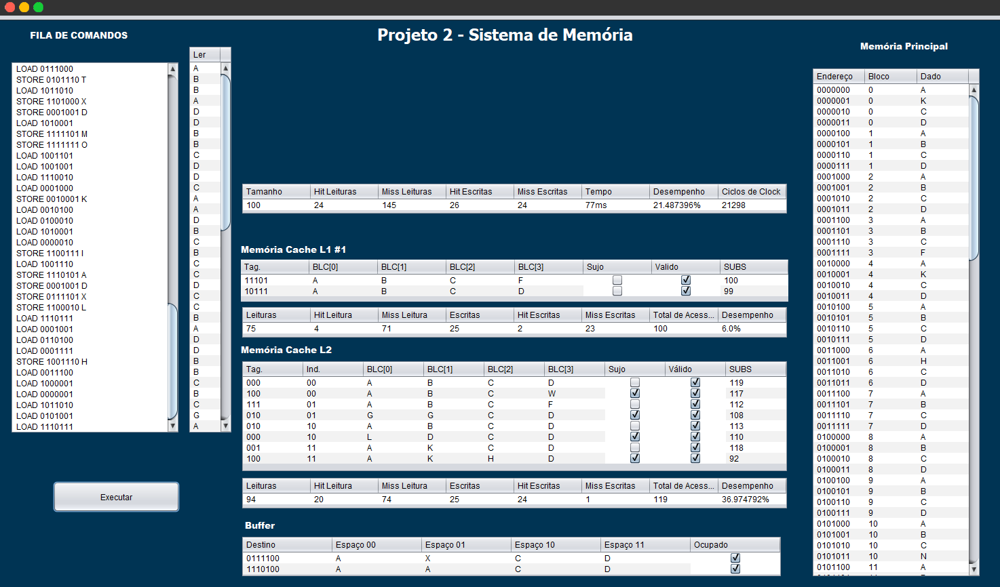

# ProjetoArq_SimuladorCache

	 
	
	 

Se o desempenho do processador fosse atrelado ao desempenho da memória RAM, os PCs já teriam estagnado a um bom tempo, já que simplesmente não faria sentido desenvolver processadores mais rápidos, apenas para que eles passassem esperar mais e mais ciclos pelas leituras na memória. A solução veio com a introdução da memória cache, que serve como um reservatório temporário de dados com grande possibilidade de serem usados pelo processador, reduzindo a percentagem de vezes em que ele precisa buscar informações diretamente na memória.

Sempre que precisa de novas informações, o processador checa primeiro as informações disponíveis no cache L1. Caso não encontre o que precisa, ele verifica em seguida o cache L2 e por último a memória. Sempre que o processador encontra o que precisa nos caches temos um "cache hit" e sempre que precisa recorrer à memória temos um "cache miss". Quanto maior a percentagem de cache hits, melhor é o desempenho.

 <ol>
<li dir="ltr">
<h1 dir="ltr">Desenvolvimento</h1>
</li>
</ol>

Para o projeto, foi definido a estrutura da seguinte forma:

<ul>
<li dir="ltr">

O cache L1 é menor que a L2 e oferece tempos de acesso muito baixos, equivalentes a apenas 3 ciclos de clock. 

</li>
<li dir="ltr">

O cache L2 por sua vez, tem 4 vezes o tamanho da L1, mas ele em compensação trabalha com tempos de acesso mais altos, de tipicamente 14 ciclos de clock.

</li>
<li dir="ltr">

A memória RAM tem 128 células, equivale a 4 vezes o tamanho da cache L2, mas em contrapartida, tem 240 Ciclos de clock.

</li>
</ul>
 

Foi utilizado duas formas (heurísticas) para selecionar o elemento a ser retirado, LRU e FIFO.

Podendo ser escolhido no início da execução.

 

Bloco ou linha: unidade de informação mínima que pode estar presente ou ausente na hierarquia de dois níveis. Consiste de múltiplas palavras contíguas na memória.  

Hit: dados encontrados em algum bloco durante a pesquisa ou escrita. 

Miss: dados não encontrados, precisa acessar o nível inferior.  

Total de acessos: Total de acesso a memória Cache

Desempenho: Porcentagem de acertos de falhas na execução do algoritmo.

Tempo: Tempo de execução do algoritmo

Ciclos de Clock: Quantidade de ciclos do processador para determinada instrução.
